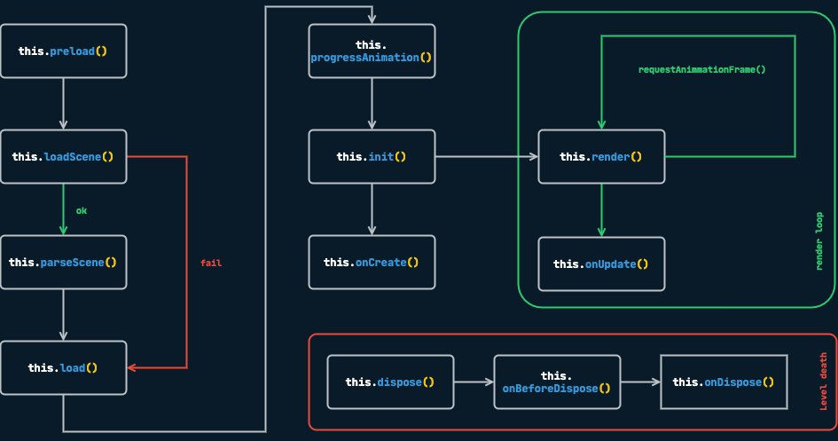

# Level

## What is a Level?

A **Level** is the fundamental building block of any Mage application. Think of it as a self-contained scene or stage in your game—it could be a menu screen, a gameplay area, a cutscene, or any distinct section of your experience.

Levels serve several important purposes:

- **Organization**: They help you structure your game into logical, manageable pieces
- **Resource Management**: Each level can define its own assets, which are loaded when entering and disposed when leaving
- **State Isolation**: Levels maintain their own state and lifecycle, making it easier to reason about your game's flow
- **Navigation**: Combined with the Router, levels enable seamless transitions between different parts of your application

Every level you create must be a class extending `Level` from `mage-engine`:

```js
import { Level } from 'mage-engine';

export default class MyLevel extends Level {

    onCreate() {
        // Your level setup goes here
        // Add elements, configure lights, set up physics, etc.
    }
}
```

---

## Common Workflows

### Setting Up a Basic Level

The most common workflow is creating a level with some 3D elements:

```js
import { Level, Cube, AmbientLight, Scene } from 'mage-engine';

export default class GameLevel extends Level {

    onCreate() {
        // 1. Add lighting so objects are visible
        const light = new AmbientLight({ color: 0xffffff, intensity: 0.8 });
        
        // 2. Create and position your game objects
        const player = new Cube(2);
        player.setPosition({ x: 0, y: 1, z: 0 });
        
        // 3. Set up the camera
        Scene.getCamera().setPosition({ x: 0, y: 5, z: 10 });
    }
}
```

### Connecting Levels to Your App

Levels don't work in isolation—they need to be registered with the Router so your application knows when to load them:

```js
import { Router } from 'mage-engine';
import MenuLevel from './levels/Menu';
import GameLevel from './levels/Game';

window.addEventListener('load', function() {
    // Map URL paths to levels
    Router.on('/', MenuLevel);           // Landing page shows menu
    Router.on('/game', GameLevel);       // /game path loads the game
    
    Router.start(config, assets);
});
```

::: tip
The Router handles all the complexity of loading assets, transitioning between levels, and cleaning up resources. Learn more about routing [here](/engine/advanced/router).
:::

---

## Lifecycle Methods

Levels have a predictable lifecycle that helps you manage setup, updates, and cleanup. Understanding this flow is crucial for building robust games.



### onCreate()

**When it's called**: After assets are loaded and the scene is ready.

**What to do here**: This is your main entry point. Set up your level's elements, configure lighting, enable physics, attach scripts, and prepare everything the player will interact with.

```js
onCreate() {
    // Safe to do everything here
    this.setupEnvironment();
    this.spawnPlayer();
    this.initializeUI();
}
```

### onUpdate(dt)

**When it's called**: Every frame, receiving the delta time since the last frame.

**What to do here**: Handle level-wide logic that doesn't belong to individual elements. For element-specific behavior, prefer using [Scripts](/engine/advanced/scripting/scripts) instead.

```js
onUpdate(dt) {
    // Check win/lose conditions
    if (this.player.health <= 0) {
        Router.go('/game-over');
    }
    
    // Update level timer
    this.elapsedTime += dt;
}
```

### onStateChange(state)

**When it's called**: Whenever the Redux store is updated.

**What to do here**: React to global state changes, like updating UI or triggering level events based on game state.

```js
onStateChange(state) {
    if (state.game.paused) {
        this.pauseAllAnimations();
    }
}
```

::: tip
For state management patterns, see the [State Management](/engine/advanced/state_management) guide.
:::

---

## Level Disposal

When navigating away from a level, Mage automatically cleans up resources. You can hook into this process for custom cleanup.

### onBeforeDispose()

**When it's called**: Just before disposal begins.

**What to do here**: Save state, stop ongoing processes, or prepare for cleanup.

```js
onBeforeDispose() {
    // Save player progress before leaving
    this.saveProgress();
    
    // Stop any audio
    this.backgroundMusic.stop();
}
```

### onDispose()

**When it's called**: After disposal is complete.

**What to do here**: Final cleanup tasks, like clearing external references.

---

## Working with URL Parameters

Levels can receive configuration through URL query parameters, making them flexible and reusable:

```js
// URL: www.yourgame.com/?difficulty=hard&level=5#/game

export default class GameLevel extends Level {
    
    onCreate() {
        // Access URL parameters via this.options
        const { difficulty, level } = this.options;
        
        console.log(difficulty); // "hard"
        console.log(level);      // "5"
        
        this.configureDifficulty(difficulty);
        this.loadLevel(level);
    }
}
```

---

## API Reference

### constructor(options: object)

The constructor receives URL query parameters as an `options` object, available as `this.options`.

### loadScene(url: string)

Loads a JSON scene file. By default, Mage looks for `assets/scenes/${LevelName}.json`.

### toJSON(): object

Returns a JSON representation of the level, useful for scene export or debugging.
