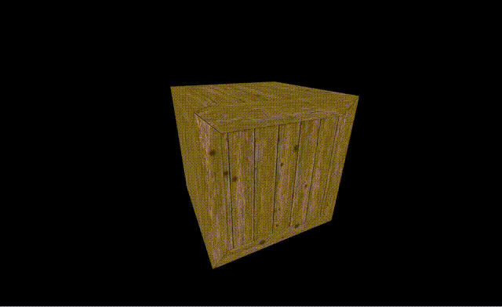

# Applying Textures

So far, we created a lonely box in the middle of the screen. We're now going to add a texture to it.
Only a couple things are needed in order to load a texture on our box:

First, the texture itself. Yes, use the image below.
<br/>
 

Then, a new entry in our app assets description. Remember the assets object we created in the `index.js` file earlier? We're going to change it like so:

### index.js
```js
const config = {};
const assets = {
    textures: {
        crate: 'PATH/TO/YOUR/wood_crate.jpg'
    }
};

window.addEventListener('load', () => {
    // same code we had before
});
```

- We added a new `textures` field in our `assets` object. Each entry will be used by the engine to load the textures automatically at startup. This means that when the application is running, each texture is ready to be used. 

>In this case, the crate texture will be referenced using the name `crate`, the key used in the definition.

::: tip
Assets configuration can get a bit more complicated than this, please refer to the proper documentation page here: [Loading Assets](/engine/advanced/assets/loading.md).
:::
:::


### Applying texture to the cube

Now we simply need to apply the texture to the previously created cube. In [Hello Cube](/engine/getting-started/hello-cube.md) we created the first version of our level. Now, we simply need to change it like so:

```js
import {
    Level,
    Cube,
    Scripts
} from 'mage-engine';

class FirstLevel extends Level {

    onCreate() {
        Scripts.create('rotation', RotationScript);

        const size = 10;
        const cube = new Cube(size);

        cube.setTextureMap('crate');
        cube.setPosition({ x: 0, y: 0, z: 0});
        cube.addScript('rotation');
    }
}

export default FirstLevel;
```

What happened here?

- `cube.setTextureMap('crate')`: this method is setting the texture on the cube. This method accepts a parameter, which is the name of the texture. The name is defined in your assets configuration object.
- We removed the color from the initialisation of the cube.

Running the application now should result in something looking like this:



Yes, I know what you're thinking, this looks exactly like before! Let's make the scene a bit more interesting by adding some [lights and a skybox](/engine/getting-started/lights_and_skybox.md).