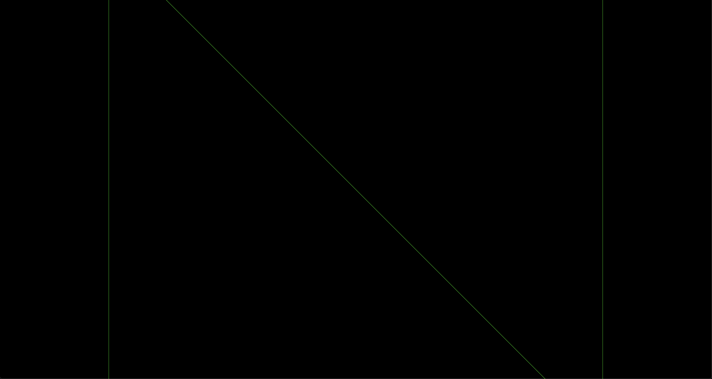

# Hello Cube

Adding a cube to the scene is incredibly straightforward. What you need to do is import it from `mage-engine` and create a new instance of it. Our newly created `FirstLevel` will look like this:

```js
import { Level, Cube } from 'mage-engine';

class FirstLevel extends Level {

    onCreate() {
        const size = 10;
        const color = 0x00ff00;
        const cube = new Cube(size, color);

        cube.setWireframe(true);
        cube.setPosition({ x: 0, y: 0, z: 0});
    }
}

export default FirstLevel;
```

---

## A bit of style first

Before we add anything to our new scene, we should add some style.

```css
    canvas {
        position: absolute;
        margin: 0;
        padding: 0;
        top: 0;
        left: 0;
        height: 100%;
        width: 100%;
    }
```

You can inject this style in our `index.html` for now.

---

## Run the application

::: warning
We're going to assume you know how to bundle your application. Bundling the app should produce some distributable files (mainly a `app.js` and one `app.css`). If you're not sure how to achieve this, have a look at the [Bundling](/engine/advanced/bundling.md) page.
:::
  
For now, the best way to launch the application is to use a python module called `SimpleHTTPServer`. When invoked, it will launch a simple HTTP server (hence the module name) in your root folder.

```python
python -m SimpleHTTPServer
```

If you now navigate to `http://localhost:8000/`, you should see something like this:



A bit disappointing, right? We can do something to improve it by moving the [Camera](/engine/getting-started/camera.md) a bit.
