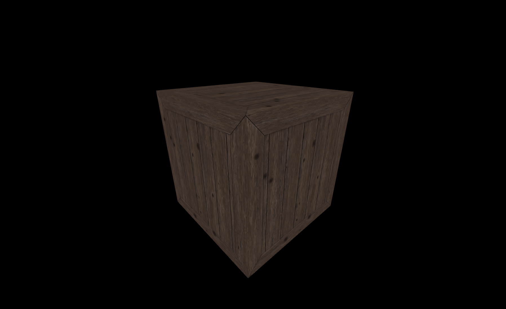
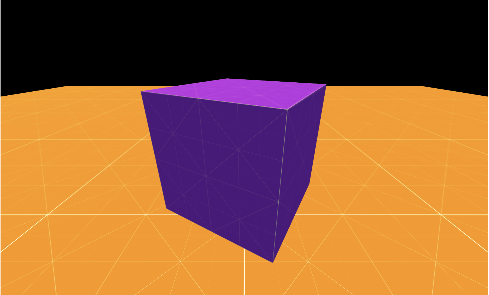
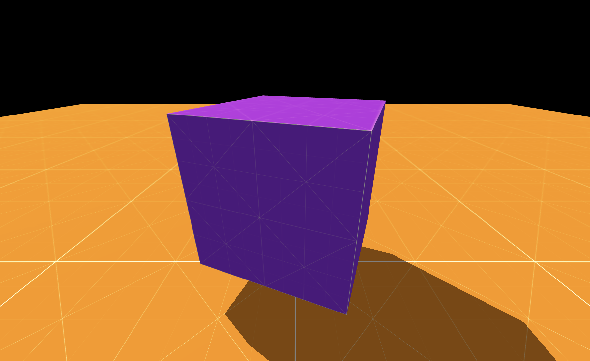
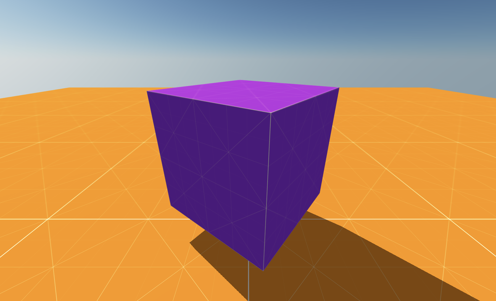

# Lights and Skybox

So far, we haven't created anything particularly exciting. In this guide, we're going to add lights to the scene, a floor, and a bunch of friends to our lonely crate.

## Let there be light!

First of all, let's add a nice `AmbientLight`. The steps are very simple:

```js
import {
    // all the imports we had before
    AmbientLight,
    PALETTES,
    constants
} from 'mage-engine';

const { MATERIALS } = constants;

class FirstLevel extends Level {

    letThereBeLight() {
        const ambientLight = new AmbientLight({
            color: PALETTES.BASE.WHITE,
            intensity: .5
        })
    }

    onCreate() {
        // the same code we had before
        // updating cube material to STANDARD
        cube.setMaterialFromName(MATERIALS.STANDARD)
        this.letThereBeLight();
    }
}

export default FirstLevel;
```

A number of things have happened here:
- We imported `AmbientLight` from `mage-engine`. When initialised, it will be automatically added to the scene. For this light, we passed some options:
    - `color`: this will be defaulted to `WHITE` if missing.
    - `intensity`: this will be defaulted to `1` if missing. We chose an intensity of `.5`.

::: tip
Mage engine provides a set of palettes ready to use. The one we used here is the base one. More colors and options are available [here](/engine/advanced/core/constants.md)
:::
:::


- We also changed the cube material. This is needed because by default elements in the scene are using `BASIC` material, which is not affected by lights.

::: tip
For more details on elements API, refer to this page [here](/advanced/core/element.md);
:::
:::


::: tip
For more details around materials, visit [this page](https://threejs.org/docs/?q=basic#api/en/materials/MeshBasicMaterial).
:::
:::


Once everything is done and dusted, you should be able to see something like this:



a bit too dark, don't you think?

## Lights and shadows

Before we start adding shadows, we're going to change textures and we're going to add a floor. Download the following textures:

<br/>


Now, update the assets config to look like this:

```js
const assets = {
    textures: {
        crate: 'path/to/the/previous/crate.png',
        orange: 'path/to/orange.png',
        purple: 'path/to/purple.png'
    }
}
```

::: tip
Why are we updating textures, you may ask? No particular reason, just felt like it looked better.
:::
:::


Let's create a floor now, and update the cube texture.

```js
import {
    // previous imports
    Box
} from 'mage-engine';

// inside your level class
createFloor() {
    const floor = new Box(200, 1, 200);
    floor.setTextureMap('orange', {
        repeat: { x: 10, y: 10 }
    });
    floor.setMaterialFromName(MATERIALS.STANDARD);
}

onCreate() {
    // previous code
    cube.setTextureMap('purple');

    this.createFloor();
}
```

Let's now introduce a couple more lights to the scene, as well as updating the camera position a bit.

```js
import {
    // previous imports
    Scene,
    SunLight
} from 'mage-engine'


// inside your level
letThereBeLight() {
     const ambientLight = new AmbientLight({
        color: PALETTES.BASE.WHITE,
        intensity: .5
    });

    const sunLight = new SunLight({
        color: PALETTES.FRENCH_PALETTE.FLAT_FLESH,
        intensity: 1,
        far: 20,
        mapSize: 2048
    });
    sunLight.setPosition({ y: 4, z: -3, x: -3 });
}

onCreate() {
    // previous code
    const camera = Scene.getCamera();
    camera.setPosition({ z: 15, y: 15 });
    camera.lookAt(cube.getPosition());
}
```

Once everything is in place, you should see something like this:



**Where are the shadows?**
We are missing a crucial steps, enabling shadows. Go back to your configuration object (the empty object we passed to Router), and update it like so:

```js
const config = {
    lights: {
        shadows: true,
    }
}
```

- shadows are not enabled by default, and you need to set the flag to `true` like so.

::: tip
More information about configuration can be found [here](/engine/advanced/configuration.md)
:::
:::


Once shadows are enabled, the scene should look like this:



Things started to look a bit nicer! What about adding the last touch? A skybox maybe?

Let's add a new method to define the sky, and let's invoke in our `onCreate` lifecycle method.

```js
import {
    // previous imports
    Sky
} from 'mage-engine';

// inside the level class
createSky() {
    const sky = new Sky();
    const inclination = .1;
    const azimuth = .1;
    const distance = 100;
    
    sky.setSun(
        inclination,
        azimuth,
        distance
    );
}

onCreate() {
    // what we had before
    this.createSky();
}
```

- `Sky` is one of the many effects available within `mage-engine`. You can find out more about it in its dedicated page [here](/engine/advanced/effects/scenery/sky.md);

Here is the final look of what we achieved so far:


### What's next?
Now that we have a somewhat decently looking scene, how about we complicate things by [introducing physics to the mix](/engine/getting-started/physics.md)?