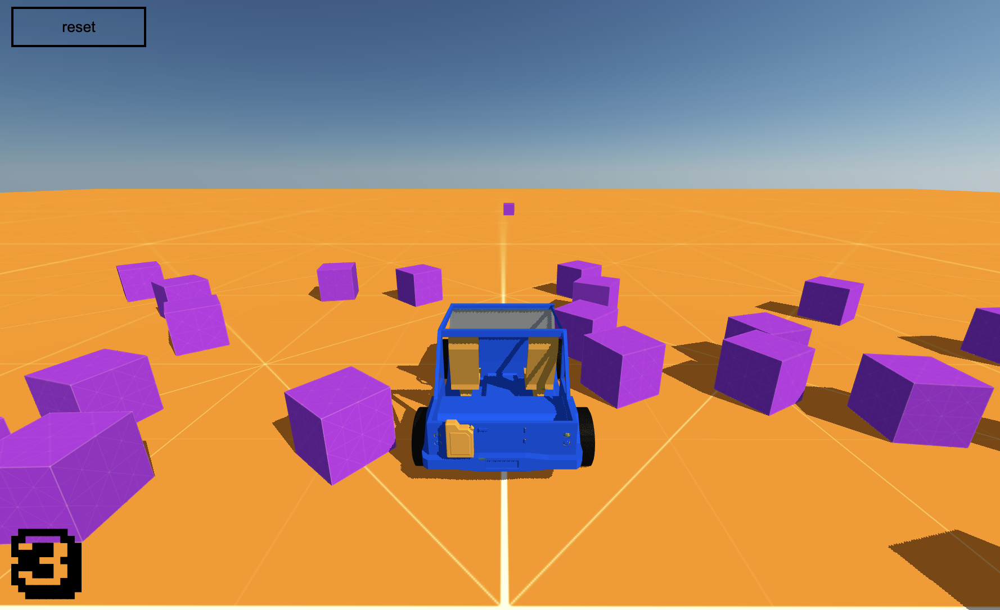

# User Interface

This guide will give you a short introduction to UI. Mage engine uses `inferno` for its components and `redux` for state management.

!> This guide is assuming you have basic knowledge of how React-like UI frameworks work, so it's not going into details when it comes to the inner workings of the framework.

?>  The topic is quite extensive, and it's fully covered in its dedicated page. For more information about state management, head over [here](/engine/advanced/state_management.md). If you need a deeper introduction to UI, please refer to [this page](/engine/advanced/ui.md).

For this guide, we're going to introduce two simple components, one called `SpeedIndicator` and another one called `ResetButton`.
First, let's create the `SpeedIndicator` component.

### SpeedIndicator.js

```js
const SpeedIndicator = ({ speed }) => {
    return (
        <span>
            { speed }
        </span>
    );
};

export default SpeedIndicator
```

Pretty self explanatory, this will render a component that contains a `span` displaying the current speed of the car.

### ResetButton.js

```js
const ResetButton = ({ onClick }) => {
    return (
        <button onClick={onClick}>
            reset
        </button>
    );
};

export default ResetButton;
```

This one is quite easy as well. It will display a button on screen: its purpose is to reset the car to its initial position if you fall off the edge.

### Root.js

Let's now create a root component that will take care of both child components.

```js
import { Component } from 'inferno';
import {
    // previous imports
    GameRunner
} from 'mage-engine';

class Root extends Component {
    constructor(props) {
        super(props);

        this.state = {
            speed: 0
        };
    }

    componentDidMount() {
        setInterval(() => {
            const level = GameRunner.getCurrentLevel();
            if (level && level.car) {
                const { speed } = level.car.getPhysicsState();
                this.setState({ speed });
            }
        }, 250);
    }

    handleResetButtonClick = () => {
        GameRunner
            .getCurrentLevel()
            .resetCar();
    }

    render() {
        const { speed } = this.state;

        return (
            <>
                <SpeedIndicator speed={speed}>
                <ResetButton onClick={this.handleResetButtonClick}>
            </>
        )
    }
}
```

What is happening in `Root.js`:
- We set up a timer, every `250ms` we're going to get the current running level, get the car instance and extract its speed.
  - `GameRunner.getCurrentLevel()`: belongs to the `GameRunner` module, which is responsible for running your levels. This method will return the instance of the level that is currently playing.
  - `car.getPhysicsState()` will return the current physic state for the object.

?> More information on `GameRunner` is available on its dedicated page [here](/engine/advanced/gamerunner.md). The same applies for the `Element` [page](/engine/advanced/core/element.md), where `getPhysicsState` is explained.

- We're also setting a `onClick` event handler on our button. When pressed, it wil call the `resetCar` method on our current level. Unfortunately, we don't have that yet. So let's go back to our level and create it:

### Level.js
```js
import {
    // previous imports
    Physics
} from 'mage-engine';

// inside your level class
resetCar() {
    const position = {
        x: 0, 
        y: 20,
        z: 0
    };
    Physics.resetVehicle(this.car, position, constants.ZERO_QUATERNION);
}
```

What is happening here?
- We are calling `Physics.resetVehicle()`: since this is a phyisics based example, we need to inform the Physics module we want to reset our vehicle to a desired position and rotation. In this case, we're resetting the car to `{ x: 0, y: 20, z: 0 }` with no rotation (`constants.ZERO_QUATERNION`).

?> More on the Physics module in its dedicated [page](/engine/advanced/physics.md).

## Enabling UI

Enabling UI is pretty straightforward. Just head over your configuration object, and add the following:

```js
import Root from './path/to/Root.js';

const config = {
    // previous config
    ui: {
        root: Root
    }
}
```

?> Again, configuration has its dedicated page [here](/engine/advanced/configuration.md).

This is all you need to enable the UI for this example.

!> Purpose of this guide is not to explain you how to style your UI. You can use regular CSS to position everything on your screen, including the `canvas` element where your scene is rendered.

### How does it look like?
For me, something like this: 


As you drive around, you should be able to see your speed displayed in the `SpeedIndicator` component. When pressing the reset button, your car should reset to the position we defined earlier.

Is this [the end?](/engine/getting-started/the_end.md)